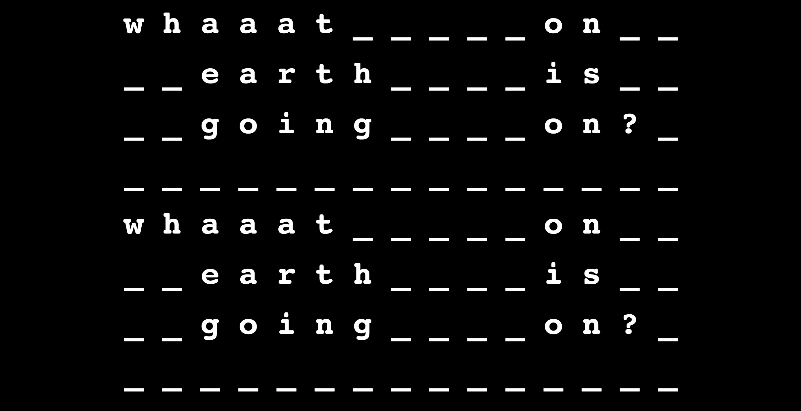
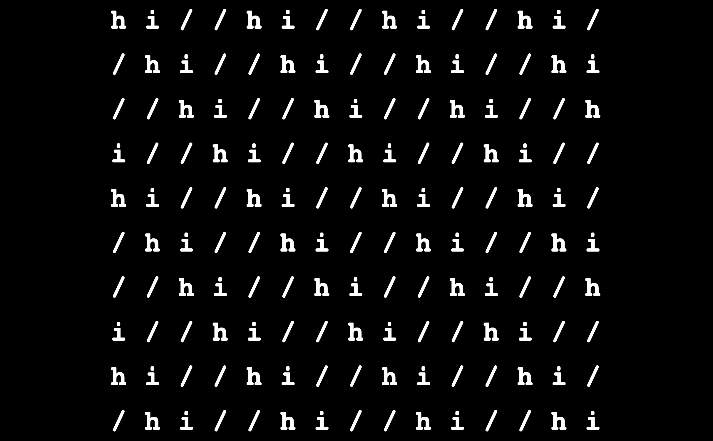

# Bauhaus Live View:
Inspired by an interactive part of a Bauhaus exhibition. 

Type characters into the keyboard and watch the server-side rendered templates update in real time:

# Get it started:
- `mix deps.get`
- `cd assets && npm install`
- `mix phx.server`
- [`localhost:4000`](http://localhost:4000)